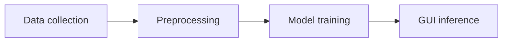

# Predict Medical Direction

A text classification project that routes a short patient description to a medical department. Includes data collection scripts, preprocessing, training code, and a simple Tkinter GUI for testing.

## Diagram



## Project Structure

```
Predict_medical_direction/
  app/            # GUI for testing
  data/           # Data collection scripts and raw samples
  preprocessing/  # Text cleaning and feature extraction
  training/       # Model training and evaluation
  requirements.txt
```

## Requirements

- Python 3.8+
- Packages listed in `requirements.txt`
- Tkinter (usually bundled with Python on desktop OS)

Install:

```bash
python3 -m venv venv
source venv/bin/activate
pip install -r requirements.txt
```

## Run the GUI

```bash
python app/gui.py
```

## Notes

- The GUI expects a trained model artifact (see `training/`).
- If you modify preprocessing, retrain the model to keep features consistent.
